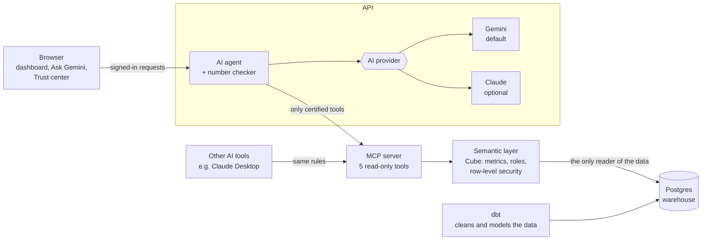

# Governed Banking Analytics

**Ask questions about a bank's performance in plain English, and get answers you can trust.**

Governed Banking Analytics is a complete demo for bank leadership (built with a CMO in mind). It combines three things
in one web app:

- an **executive dashboard** with the bank's key numbers and trends,
- **Ask Gemini**, an AI assistant that answers questions like *"Why did Young Professionals churn rise last quarter?"*,
- a **Trust center** that shows who asked what, how every number was calculated, and whether the books balance.

What makes it different: **every number comes from one certified definition.** The dashboard, the AI and the audit log
all use the same governed metrics, so two reports can never disagree about what "churn" or "CASA ratio" means.

> All data is synthetic: a made-up Bangladeshi retail and SME bank, generated with a fixed seed.
> No real customer data is used anywhere.

---

## Contents

- [What you can do](#what-you-can-do)
- [Why you can trust the numbers](#why-you-can-trust-the-numbers)
- [Who sees what](#who-sees-what)
- [How it works](#how-it-works)
- [Run it on your computer](#run-it-on-your-computer)
- [Put it online](#put-it-online)
- [Managing users](#managing-users)
- [Choosing the AI model](#choosing-the-ai-model)
- [Connect other AI tools (MCP)](#connect-other-ai-tools-mcp)
- [Troubleshooting](#troubleshooting)
- [Using it with a real bank](#using-it-with-a-real-bank)
- [What's in the repository](#whats-in-the-repository)
- [Known limitations](#known-limitations)

---

## What you can do

| Page | What it's for |
|---|---|
| **Executive dashboard** | Six headline KPIs (total deposits, CASA ratio, NPL ratio, net interest margin, active customers, churn) with month-on-month change and trend lines, plus charts by segment and channel, a branch league table and campaign performance. |
| **Ask Gemini** | Type a question in plain English. You get a written answer, a chart, the data table, the official definition of every metric used, and the exact query that produced it. |
| **Trust center** | The **audit log** (every question and query, by whom), a **reconciliation** of deposits and loans against the general ledger, and the **metric dictionary** with owners, formulas and caveats. |
| **Users** *(admins only)* | Create accounts and decide what each person can see. |

The app works in light and dark mode and on phones.

## Why you can trust the numbers

The AI never touches the database directly, and it never writes SQL. It can only ask a **semantic layer** (Cube) for
**certified metrics**, the same way the dashboard does. On top of that:

1. **One definition per metric.** Each metric is defined once, in code, with an owner, a formula and a time rule
   (for example "CASA ratio = CASA balance ÷ total deposits, at month end").
2. **Every figure is checked.** Before an answer is shown, every number in Gemini's text is compared with the query
   results. If a figure doesn't match, Gemini gets one chance to correct it; if it still doesn't match, the written
   answer is withheld and only the verified tables are shown. Answers that pass show a **Figures verified** badge.
3. **You can see the working.** Under each answer, *How this was calculated* shows the exact semantic-layer query.
4. **Everything is logged.** Every question and every query, allowed or denied, is recorded in the audit log.
5. **The books are reconciled.** Deposits and loans are compared with general-ledger totals every month end
   (Trust center → Reconciliation). There's even a demo button to inject a discrepancy and watch the check fail.

Want to check a number yourself? Every metric's formula is in the metric dictionary, so you can recompute it straight
from the database and compare.

## Who sees what

Each account has one of three roles. The rules are enforced by the semantic layer itself, so they apply to the
dashboard, the AI and external tools alike. Gemini cannot get around them.

| Role | Sees |
|---|---|
| **CMO** | Everything, bank-wide. |
| **Branch manager** | Only their own branch. Bank-wide figures (e.g. the general ledger) are hidden. |
| **Analyst** | Totals and breakdowns only. No customer-level detail. |

Sign in as a branch manager and ask the same question as the CMO: you'll get a different, branch-only answer.

## How it works



In short: **your question → the AI agent → governed tools → the semantic layer → the warehouse.** The dashboard uses
the same tools, so the charts and the AI always agree.

The building blocks, all open source and running in Docker:

| Part | Job |
|---|---|
| **Postgres** | The data warehouse (raw data, cleaned models, audit log, user accounts). |
| **dbt** | Turns raw data into clean, tested tables, including history of each customer's segment and branch. |
| **Cube** | The semantic layer: metric definitions, roles and row-level security. |
| **MCP server** | Exposes the certified metrics as 5 read-only tools (to the app and to other AI tools). |
| **API** | The AI agent, the number checker, dashboards, accounts and the audit trail. |
| **Web** | The Next.js app you use in the browser. |

## Run it on your computer

**You'll need:** Docker Desktop (give it at least 4 GB of memory), Python 3.13, Node 24, `make`, and a free
[Gemini API key](https://aistudio.google.com/apikey).

1. **Create your settings file.**
   ```bash
   cp .env.example .env
   ```
   Open `.env` and set `GEMINI_API_KEY`. Optionally set `ADMIN_USERNAME` and `ADMIN_PASSWORD` to get an admin account.
2. **Install the helper tools.**
   ```bash
   pip install -r requirements-dev.txt
   ```
3. **Start everything.**
   ```bash
   make demo
   ```
   The first run takes about 10 minutes. It downloads the containers, generates the bank data, builds the models and
   warms up the semantic layer.
4. **Open <http://localhost:3000>** and sign in. On your computer the sign-in page offers one-click demo accounts
   (password `demo123`): **CMO**, **Branch manager** (Narayanganj) and **Analyst**.

**On Windows without `make`?** Run the same steps by hand:
```bash
docker compose up -d postgres --wait
docker compose --profile tools run --rm seed
docker compose --profile tools run --rm dbt build
docker compose up -d --build
python scripts/warmup.py
```

**Useful local addresses**

| Address | What |
|---|---|
| <http://localhost:3000> | The app |
| <http://localhost:8000/docs> | API reference |
| <http://localhost:8765/mcp> | MCP server |
| <http://localhost:4000> | Cube (semantic layer) API, needs a token |

**Other commands:** `make test` (Python tests), `make test-web` (browser tests), `make eval PROVIDER=gemini` (AI accuracy
check), `make recon-break` / `make recon-fix` (demo a ledger mismatch), `make lint`, `make down` (stop everything).
A 10-minute presentation script is in [docs/DEMO.md](docs/DEMO.md).

## Put it online

You can run the whole thing on a single Linux server (Ubuntu or Debian, 4 GB+ memory), for example a Hostinger KVM VPS.
You get a proper `https://` address with an automatic certificate.

1. **Point a domain at your server.** In your DNS settings, add an `A` record such as `analytics.yourdomain.com` →
   your server's IP address.
2. **Open ports 80 and 443** in your server's firewall (on Hostinger: VPS → Firewall).
3. **Install and start** (on the server, as root):
   ```bash
   git clone https://github.com/SharifNirjon/Semantic-Layer-Finance.git
   cd Semantic-Layer-Finance
   sudo ./deploy/deploy.sh analytics.yourdomain.com
   ```
   Use your real domain here, not the example. The script asks for your Gemini API key and your admin account
   (username, full name, password). It installs Docker if needed, builds the bank data on the first run (15-30 minutes),
   and starts everything.
4. **Open `https://analytics.yourdomain.com`**, sign in as the admin, and add people under **Users**.

**Updating later:** run `git pull` then `sudo ./deploy/deploy.sh` again. Your data, keys and accounts are kept.

**Already running n8n (or another Caddy) on the server?** No problem. The script notices that ports 80/443 are taken by
an existing Caddy, adds this site to it (keeping a backup of its config) and leaves your other sites untouched.

**Security:** only the web entrance is public. The database, semantic layer, MCP server and API are reachable only from
the server itself. Fixed demo logins are switched off in production. Secrets live in `.env`, readable only by root.

### Automatic deploys from GitHub (optional)

Every push to `main` can update the live site by itself (`.github/workflows/deploy.yml`). One-time setup:

1. On the server, create a key for GitHub and authorize it:
   ```bash
   ssh-keygen -t ed25519 -f ~/gh_deploy -N ""
   cat ~/gh_deploy.pub >> ~/.ssh/authorized_keys
   cat ~/gh_deploy        # copy this
   ```
2. In GitHub, open the repository's **Settings → Secrets and variables → Actions** and add:
   - `VPS_HOST`: your server's IP address
   - `VPS_SSH_KEY`: the key you copied
   - `VPS_APP_DIR`: only if the repository isn't at `/root/Semantic-Layer-Finance`

Each deploy appears under the **Actions** tab, and **Run workflow** deploys on demand.

## Managing users

- **The first admin** comes from `ADMIN_USERNAME` / `ADMIN_PASSWORD` in `.env` (the deploy script asks for them).
- **Everyone else** is added by an admin on the **Users** page: username, full name, password and role (plus the branch
  for branch managers). Admins can also change roles, reset passwords, deactivate accounts or delete them.
- **Changes apply immediately.** A deactivated person, or someone whose role changed, is signed out on their next click.
- **Forgot the admin password?** Change `ADMIN_PASSWORD` in `.env` on the server and run `sudo ./deploy/deploy.sh`.
- Passwords are stored as one-way hashes (scrypt), never in plain text in the database.

## Choosing the AI model

The app uses **Gemini** by default (`gemini-3.6-flash`). If Google's servers are busy or slow, it automatically retries
on a lighter backup model (`gemini-3.1-flash-lite`), so answers don't hang.

To change it, edit `.env` and restart the API (or re-run the deploy script):

| Setting | Meaning |
|---|---|
| `GEMINI_MODEL` | Main Gemini model |
| `GEMINI_FALLBACK_MODEL` | Backup model used when the main one is overloaded |
| `LLM_TIMEOUT_S` | How long to wait for one AI call before retrying (seconds) |
| `LLM_PROVIDER=anthropic` + `ANTHROPIC_API_KEY` | Use Claude instead of Gemini |

Switching provider needs no code changes: everything provider-specific lives in `api/app/providers/`. Without any AI key,
the dashboard, the Trust center and the MCP server still work.

## Connect other AI tools (MCP)

The same certified metrics, with the same role rules, are available to any AI tool that supports the
[Model Context Protocol](https://modelcontextprotocol.io), such as Claude Desktop.

1. Create an access token for a role (add `--branch 7` for a branch manager):
   ```bash
   python scripts/make_token.py cmo
   ```
2. Add the server to your tool. For Claude Desktop:
   ```json
   {
     "mcpServers": {
       "governed-banking": {
         "command": "npx",
         "args": ["-y", "mcp-remote", "http://localhost:8765/mcp", "--header", "Authorization: Bearer <TOKEN>"]
       }
     }
   }
   ```

The 5 tools are all read-only: `list_catalog`, `describe_metric`, `query_metrics`, `compare_periods` and `top_movers`.
There is no SQL tool. Every call shows up in the Trust center's audit log.

<details>
<summary>Running the MCP server locally over stdio instead</summary>

```json
{
  "mcpServers": {
    "governed-banking": {
      "command": "python",
      "args": ["-m", "app"],
      "env": {
        "PYTHONPATH": "/abs/path/to/repo/mcp-server",
        "MCP_TRANSPORT": "stdio",
        "MCP_JWT": "<TOKEN>",
        "JWT_SECRET": "<same as .env>",
        "CUBE_URL": "http://localhost:4000",
        "POSTGRES_HOST": "localhost"
      }
    }
  }
}
```
</details>

## Troubleshooting

| Problem | What to do |
|---|---|
| **"The AI model is not configured yet"** | Add `GEMINI_API_KEY` to `.env` and restart the API (`docker compose up -d api`, or re-run the deploy script). |
| **Answers are slow or stuck on "Thinking..."** | Usually Google's servers are busy. The backup model kicks in automatically; check `docker compose logs api --tail 50` if it persists. |
| **Browser says "can't provide a secure connection"** | The certificate isn't issued yet. Check that your domain's `A` record points to the server, that ports 80/443 are open, and that you deployed with your real domain. Then wait a minute. |
| **Can't sign in** | Production has no demo accounts: use the admin account from `.env`, or ask an admin to create one for you. |
| **A container is "unhealthy"** | `docker compose ps` shows which one; `docker compose logs <name> --tail 50` shows why. |

## Using it with a real bank

- **Read-only access.** Only the semantic layer (Cube) needs warehouse credentials, and only `SELECT` on the curated
  tables. Point it at a read replica or warehouse (Snowflake, BigQuery, Postgres, Oracle...); the metric files stay the
  same apart from table names.
- **No data copying.** Nothing is moved into this stack; the models run where the data already lives. For production
  scale, Cube Store replaces the single-node cache used here.
- **Can run fully on-premises.** Every part is a container with no cloud dependency except the AI model, and that can be a
  self-hosted or private-endpoint model (one new adapter in `api/app/providers/`).
- **Single sign-on.** Swap the built-in accounts for the bank's SSO (OIDC). The semantic layer and MCP server only need a
  signed token carrying the role and, for branch managers, the branch.
- **Governance built in.** Metric definitions go through code review, each has a named owner, the dictionary is generated
  from them, and every question is audited.

## What's in the repository

| Folder | What's inside |
|---|---|
| `scripts/` | Synthetic data generator (seed 42), loader, data-quality checks, warm-up, token helper |
| `dbt/` | Data models (staging → marts) and tests, including general-ledger reconciliation |
| `cube/` | The semantic layer: metric definitions, owners, formulas, roles, pre-aggregations |
| `mcp-server/` | The governed MCP server: validation, role pass-through, audit |
| `api/` | AI agent, AI providers, number checker, dashboards, accounts, audit and reconciliation |
| `web/` | The Next.js app and browser tests |
| `deploy/` | One-command server deployment (Caddy, production settings) |
| `tests/` | Data, golden (independent calculation vs semantic layer), security, MCP, agent and AI-accuracy tests |
| `docs/` | [Demo script](docs/DEMO.md), [metric dictionary](docs/METRIC_DICTIONARY.md), [data stories](docs/STORIES.md), [design decisions](docs/DECISIONS.md) |

## Known limitations

- The bank data is synthetic. It's realistic in shape (growth, churn, bad loans, campaigns), but it isn't real.
- The semantic layer's cache runs on a single node (fine for a demo, not for heavy production load).
- AI answer quality depends on the model you configure; `make eval` measures it on a fixed question set.
- Accounts are built in; a real deployment would connect to the bank's single sign-on instead.

More detail on the trade-offs is in [docs/DECISIONS.md](docs/DECISIONS.md).
