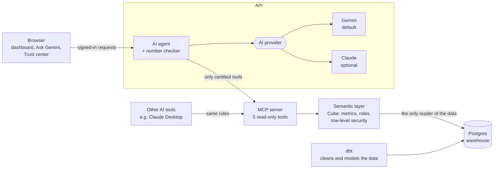

# Governed Banking Analytics

Ask a bank's data questions in plain English and get answers backed by one set of certified definitions.

This is a demo for bank leadership, built with a CMO in mind. One web app holds three things:

- an executive dashboard with the bank's key numbers and trends
- Ask Gemini, an AI assistant that answers questions like *"Why did Young Professionals churn rise last quarter?"*
- a Trust center showing who asked what, how each number was calculated, and whether the books balance

Every number comes from a single certified definition. The dashboard, the AI and the audit log all use the same governed metrics, so two reports can't disagree about what "churn" or "CASA ratio" means.

> All data is synthetic: a made-up Bangladeshi retail and SME bank, generated with a fixed seed.
> No real customer data is used anywhere.

---

## Contents

- [What you can do](#what-you-can-do)
- [Why you can trust the numbers](#why-you-can-trust-the-numbers)
- [Who sees what](#who-sees-what)
- [How it works](#how-it-works)
- [Run it on your computer](#run-it-on-your-computer)
- [Put it online](#put-it-online)
- [Managing users](#managing-users)
- [Choosing the AI model](#choosing-the-ai-model)
- [Connect other AI tools (MCP)](#connect-other-ai-tools-mcp)
- [Troubleshooting](#troubleshooting)
- [Using it with a real bank](#using-it-with-a-real-bank)
- [What's in the repository](#whats-in-the-repository)
- [Known limitations](#known-limitations)

---

## What you can do

| Page | What it's for |
|---|---|
| Executive dashboard | Six headline KPIs (total deposits, CASA ratio, NPL ratio, net interest margin, active customers, churn) with month-on-month change and trend lines. Below them: charts by segment and channel, a branch league table and campaign performance. |
| Ask Gemini | Type a question in plain English. You get a written answer, a chart, the data table, the official definition of every metric used, and the exact query that produced it. |
| Trust center | The audit log (every question and query, and who ran it), a reconciliation of deposits and loans against the general ledger, and the metric dictionary with owners, formulas and caveats. |
| Users (admins only) | Create accounts and set what each person can see. |

The app works in light and dark mode and on phones.

## Why you can trust the numbers

The AI never touches the database and never writes SQL. It can only ask a semantic layer (Cube) for certified metrics, the same way the dashboard does. Beyond that:

1. Each metric is defined once, in code, with an owner, a formula and a time rule. CASA ratio, for example, is CASA balance ÷ total deposits, at month end.
2. Before an answer is shown, every number in Gemini's text is compared with the query results. A mismatch gets one correction attempt. If it still doesn't match, the written answer is withheld and only the verified tables appear. Answers that pass carry a "Figures verified" badge.
3. Under each answer, *How this was calculated* shows the exact semantic-layer query.
4. Every question and every query, allowed or denied, goes into the audit log.
5. Deposits and loans are compared with general-ledger totals at each month end (Trust center → Reconciliation). A demo button injects a discrepancy so you can watch the check fail.

To check a number yourself, take its formula from the metric dictionary, recompute it straight from the database and compare.

## Who sees what

Each account has one of three roles. The semantic layer enforces them, so they apply equally to the dashboard, the AI and external tools. Gemini can't get around them.

| Role | Sees |
|---|---|
| CMO | Everything, bank-wide. |
| Branch manager | Only their own branch. Bank-wide figures (the general ledger, for instance) are hidden. |
| Analyst | Totals and breakdowns only, with no customer-level detail. |

Sign in as a branch manager and ask the CMO's question again. The answer will cover that branch only.

## How it works



A question goes to the AI agent, then to governed tools, then to the semantic layer, then to the warehouse. The dashboard uses the same tools, which is why its charts and the AI's answers match.

Everything is open source and runs in Docker:

| Part | Job |
|---|---|
| Postgres | The data warehouse: raw data, cleaned models, audit log, user accounts. |
| dbt | Turns raw data into clean, tested tables, including each customer's segment and branch history. |
| Cube | The semantic layer: metric definitions, roles and row-level security. |
| MCP server | Exposes the certified metrics as 5 read-only tools, to the app and to other AI tools. |
| API | The AI agent, number checker, dashboards, accounts and audit trail. |
| Web | The Next.js app you use in the browser. |

## Run it on your computer

You'll need Docker Desktop (give it at least 4 GB of memory), Python 3.13, Node 24, `make`, and a free [Gemini API key](https://aistudio.google.com/apikey).

1. Create your settings file.
   ```bash
   cp .env.example .env
   ```
   Open `.env` and set `GEMINI_API_KEY`. To get an admin account, also set `ADMIN_USERNAME` and `ADMIN_PASSWORD`.
2. Install the helper tools.
   ```bash
   pip install -r requirements-dev.txt
   ```
3. Start everything.
   ```bash
   make demo
   ```
   The first run takes about 10 minutes: it downloads the containers, generates the bank data, builds the models and warms up the semantic layer.
4. Open <http://localhost:3000> and sign in. Locally, the sign-in page offers one-click demo accounts (password `demo123`): CMO, Branch manager (Narayanganj) and Analyst.

On Windows without `make`, run the steps by hand:
```bash
docker compose up -d postgres --wait
docker compose --profile tools run --rm seed
docker compose --profile tools run --rm dbt build
docker compose up -d --build
python scripts/warmup.py
```

Local addresses:

| Address | What |
|---|---|
| <http://localhost:3000> | The app |
| <http://localhost:8000/docs> | API reference |
| <http://localhost:8765/mcp> | MCP server |
| <http://localhost:4000> | Cube (semantic layer) API; needs a token |

Other commands: `make test` (Python tests), `make test-web` (browser tests), `make eval PROVIDER=gemini` (AI accuracy check), `make recon-break` / `make recon-fix` (demo a ledger mismatch), `make lint`, `make down` (stop everything).

A 10-minute presentation script is in [docs/DEMO.md](docs/DEMO.md).

## Put it online

The whole stack runs on a single Linux server (Ubuntu or Debian, 4 GB+ memory), such as a Hostinger KVM VPS. You get an `https://` address with an automatic certificate.

1. Point a domain at the server. In your DNS settings, add an `A` record such as `analytics.yourdomain.com` pointing to the server's IP address.
2. Open ports 80 and 443 in the server's firewall (on Hostinger: VPS → Firewall).
3. On the server, as root, install and start:
   ```bash
   git clone https://github.com/SharifNirjon/Semantic-Layer-Finance.git
   cd Semantic-Layer-Finance
   sudo ./deploy/deploy.sh analytics.yourdomain.com
   ```
   Use your real domain, not the example. The script asks for your Gemini API key and an admin account (username, full name, password). It installs Docker if needed, builds the bank data on the first run (15–30 minutes) and starts everything.
4. Open `https://analytics.yourdomain.com`, sign in as the admin and add people under Users.

To update later, run `git pull` and then `sudo ./deploy/deploy.sh` again. Your data, keys and accounts are kept.

If n8n or another Caddy is already running on the server, the script detects that it holds ports 80/443, adds this site to that Caddy (backing up its config first) and leaves your other sites alone.

Only the web entrance is public. The database, semantic layer, MCP server and API can be reached only from the server itself. The fixed demo logins are off in production, and secrets live in `.env`, readable only by root.

### Automatic deploys from GitHub (optional)

Every push to `main` can update the live site through `.github/workflows/deploy.yml`. One-time setup:

1. On the server, create a key for GitHub and authorize it:
   ```bash
   ssh-keygen -t ed25519 -f ~/gh_deploy -N ""
   cat ~/gh_deploy.pub >> ~/.ssh/authorized_keys
   cat ~/gh_deploy        # copy this
   ```
2. In GitHub, go to the repository's Settings → Secrets and variables → Actions and add:
   - `VPS_HOST`: the server's IP address
   - `VPS_SSH_KEY`: the key you copied
   - `VPS_APP_DIR`: only if the repository isn't at `/root/Semantic-Layer-Finance`

Each deploy shows up under the Actions tab, and Run workflow deploys on demand.

## Managing users

- The first admin comes from `ADMIN_USERNAME` and `ADMIN_PASSWORD` in `.env`. The deploy script asks for them.
- An admin adds everyone else on the Users page: username, full name, password and role, plus the branch for branch managers. Admins can also change roles, reset passwords, deactivate accounts or delete them.
- Changes apply immediately. Someone who is deactivated or whose role changed is signed out on their next click.
- If you forget the admin password, change `ADMIN_PASSWORD` in `.env` on the server and run `sudo ./deploy/deploy.sh`.
- Passwords are stored as one-way scrypt hashes, never in plain text.

## Choosing the AI model

The default is Gemini (`gemini-3.6-flash`). If Google's servers are busy or slow, the app retries on a lighter backup model (`gemini-3.1-flash-lite`) so answers don't hang.

To change this, edit `.env` and restart the API (or re-run the deploy script):

| Setting | Meaning |
|---|---|
| `GEMINI_MODEL` | Main Gemini model |
| `GEMINI_FALLBACK_MODEL` | Backup model used when the main one is overloaded |
| `LLM_TIMEOUT_S` | How long to wait for one AI call before retrying, in seconds |
| `LLM_PROVIDER=anthropic` + `ANTHROPIC_API_KEY` | Use Claude instead of Gemini |

Switching provider needs no code changes, since everything provider-specific lives in `api/app/providers/`. With no AI key at all, the dashboard, Trust center and MCP server still work.

## Connect other AI tools (MCP)

Any AI tool that supports the [Model Context Protocol](https://modelcontextprotocol.io), Claude Desktop for example, can use the same certified metrics under the same role rules.

1. Create an access token for a role (add `--branch 7` for a branch manager):
   ```bash
   python scripts/make_token.py cmo
   ```
2. Add the server to your tool. For Claude Desktop:
   ```json
   {
     "mcpServers": {
       "governed-banking": {
         "command": "npx",
         "args": ["-y", "mcp-remote", "http://localhost:8765/mcp", "--header", "Authorization: Bearer <TOKEN>"]
       }
     }
   }
   ```

There are five tools, all read-only: `list_catalog`, `describe_metric`, `query_metrics`, `compare_periods` and `top_movers`. None of them runs SQL. Every call appears in the Trust center's audit log.

<details>
<summary>Running the MCP server locally over stdio instead</summary>

```json
{
  "mcpServers": {
    "governed-banking": {
      "command": "python",
      "args": ["-m", "app"],
      "env": {
        "PYTHONPATH": "/abs/path/to/repo/mcp-server",
        "MCP_TRANSPORT": "stdio",
        "MCP_JWT": "<TOKEN>",
        "JWT_SECRET": "<same as .env>",
        "CUBE_URL": "http://localhost:4000",
        "POSTGRES_HOST": "localhost"
      }
    }
  }
}
```
</details>

## Troubleshooting

| Problem | What to do |
|---|---|
| "The AI model is not configured yet" | Add `GEMINI_API_KEY` to `.env` and restart the API (`docker compose up -d api`, or re-run the deploy script). |
| Answers are slow or stuck on "Thinking..." | Usually Google's servers are busy, and the backup model takes over on its own. If it persists, check `docker compose logs api --tail 50`. |
| Browser says "can't provide a secure connection" | The certificate isn't issued yet. Check that the domain's `A` record points to the server, that ports 80/443 are open and that you deployed with your real domain, then wait a minute. |
| Can't sign in | Production has no demo accounts. Use the admin account from `.env`, or ask an admin to create one for you. |
| A container is "unhealthy" | `docker compose ps` shows which one; `docker compose logs <name> --tail 50` shows why. |

## Using it with a real bank

- Only the semantic layer (Cube) needs warehouse credentials, and only `SELECT` on the curated tables. Point it at a read replica or a warehouse (Snowflake, BigQuery, Postgres, Oracle and others); the metric files stay the same apart from table names.
- Nothing is copied into this stack. The models run where the data already lives. At production scale, Cube Store replaces the single-node cache used here.
- It can run fully on-premises. Every part is a container with no cloud dependency except the AI model, which can be self-hosted or sit behind a private endpoint (one new adapter in `api/app/providers/`).
- For single sign-on, swap the built-in accounts for the bank's SSO (OIDC). The semantic layer and MCP server only need a signed token carrying the role and, for branch managers, the branch.
- Metric definitions go through code review and each has a named owner. The dictionary is generated from them, and every question is audited.

## What's in the repository

| Folder | What's inside |
|---|---|
| `scripts/` | Synthetic data generator (seed 42), loader, data-quality checks, warm-up, token helper |
| `dbt/` | Data models (staging to marts) and tests, including general-ledger reconciliation |
| `cube/` | The semantic layer: metric definitions, owners, formulas, roles, pre-aggregations |
| `mcp-server/` | The governed MCP server: validation, role pass-through, audit |
| `api/` | AI agent, AI providers, number checker, dashboards, accounts, audit and reconciliation |
| `web/` | The Next.js app and browser tests |
| `deploy/` | One-command server deployment (Caddy, production settings) |
| `tests/` | Data, golden (independent calculation vs semantic layer), security, MCP, agent and AI-accuracy tests |
| `docs/` | [Demo script](docs/DEMO.md), [metric dictionary](docs/METRIC_DICTIONARY.md), [data stories](docs/STORIES.md), [design decisions](docs/DECISIONS.md) |

## Known limitations

- The bank data is synthetic. Its shape is realistic (growth, churn, bad loans, campaigns), but it isn't real.
- The semantic layer's cache runs on a single node. That's fine for a demo, not for heavy production load.
- Answer quality depends on the model you configure. `make eval` measures it on a fixed question set.
- Accounts are built in. A real deployment would connect to the bank's single sign-on.

More on the trade-offs is in [docs/DECISIONS.md](docs/DECISIONS.md).
